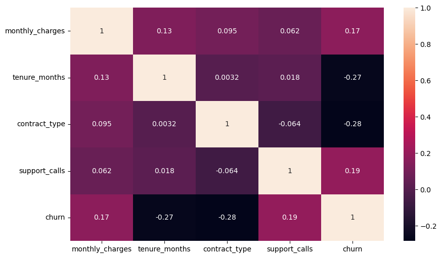
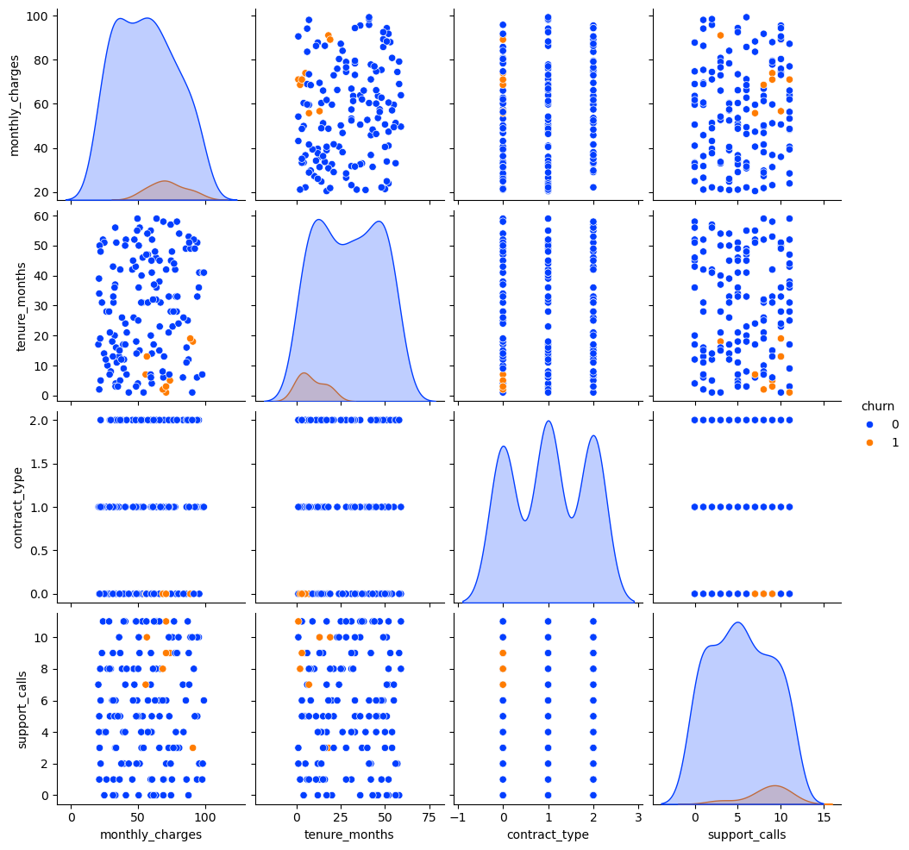
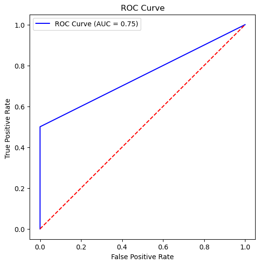

📊 Customer Churn Prediction: SVM vs Decision Tree

Overview

Customer churn is one of the biggest challenges for subscription-based businesses. Losing a customer not only affects revenue but also increases acquisition costs. This project aims to predict customer churn for a telecom company using machine learning and compare the performance of Support Vector Machine (SVM) and Decision Tree Classifier.

##Dataset

The dataset contains the following features for each customer:

monthly_charges — Monthly subscription cost.

tenure_months — Duration of customer’s subscription in months.

contract_type — Type of contract (0: month-to-month, 1: 1-year, 2: 2-year).

support_calls — Number of support calls made.

##Target:

churn — Whether the customer left the company (Yes/No).

##Methodology

Data Preprocessing:

Encode categorical features.

Scale numerical features for SVM.

Split data into training and testing sets (80/20).

##Model Training:

Support Vector Machine (SVM): Linear & RBF kernel tested.

Decision Tree: Optimized for maximum depth and Gini impurity.

##Output images
Correlation of all:

Distribution:

ROC curve:

Evaluation Metrics:

Accuracy: Overall correctness of predictions.

Precision: Correct positive predictions among all predicted positives.

Recall (Sensitivity): Correct positive predictions among all actual positives.

ROC-AUC: Model’s ability to distinguish between churn and non-churn.
##Future Work

Include additional features such as payment method, internet service type, and demographics.

Explore ensemble models like Random Forest, XGBoost, and Gradient Boosting for improved accuracy.

Deploy as a web application using Streamlit for real-time predictions.

##Project Highlights

Comparative study of SVM vs Decision Tree on real-world churn data.

Model evaluation using multiple performance metrics.

Ready for deployment in business analytics dashboards.